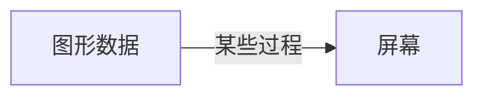
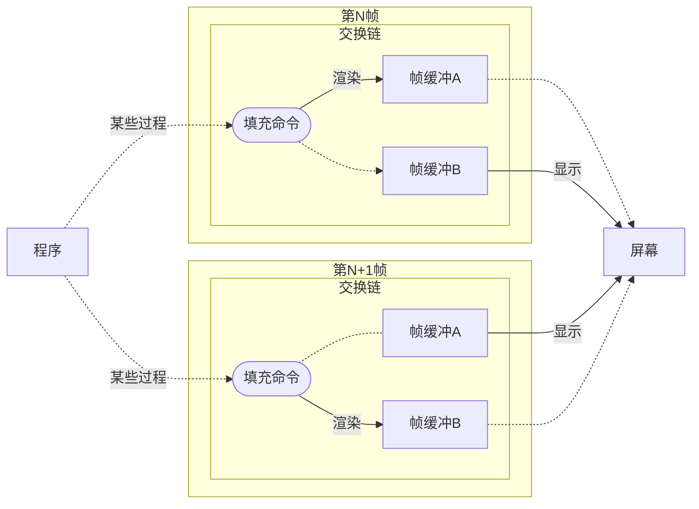
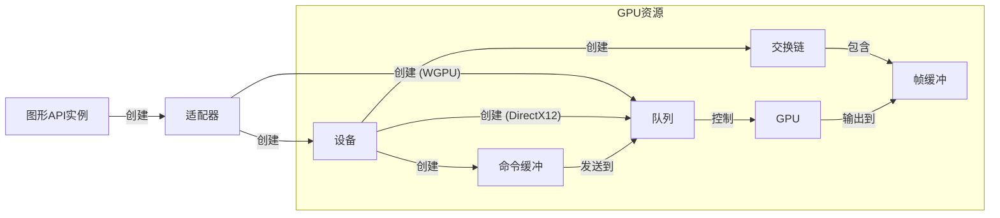
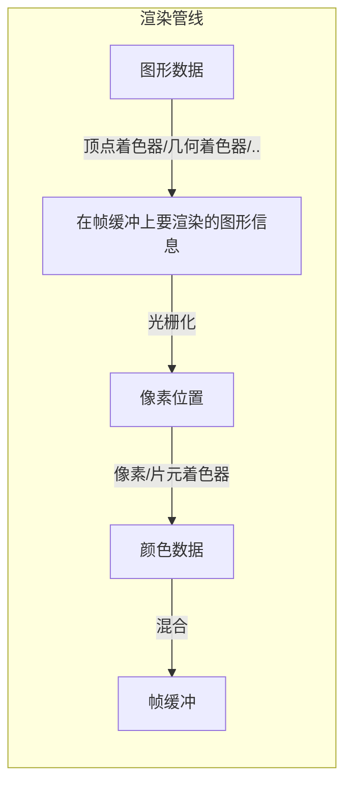

# 图形学，从入门到入土

> **注意：** 本章节含有较大量`mermaid-js`的可视化代码，如果你看到了裸露的`mermaid`代码块，请静等一段时间使得`mermaid`被正常加载。如果较长时间后仍然无法看到图形，请检查您所处的网络环境下`mermaid-js`有没有从`jsdelivr`成功加载，必要时请使用恰当的方式使其可以加载。

## 说在前面

<mask> ~~入什么门，直接入土得了~~ </mask>
本节将会对主流（底层）图形学引擎的基础概念和工作方式做一个 **概要性** 的介绍。读者可以在这一节学到图形学引擎的基础工作流程。但是本节将会省略大量在后面的章节叙述的细节内容，请有需要的读者自行查阅之后的章节。

## 基本概念

### 帧缓冲 _Frame Buffer_

我们先来考虑一下要绘制一个图形的整体过程

我们知道，屏幕实际上是一系列的发光单元阵列（下文或称为 **“像素”**），屏幕依靠改变各发光单元（各组分）的亮度来显示不同的图形。因此，我们显示在屏幕（当然实际上操作系统会帮我们显示到对应的窗口）上的东西，实际上应该是一个矩阵，而矩阵元便是亮度。我们称存放这个矩阵的缓冲为 **帧缓冲**

### 交换链 _Swap Chain_

有没有接触过老式的显像管电视机？或者一些老电脑？如果有，那你一定对扫描纹不陌生。扫描纹，是因为图像更新不及时而产生的一种显示现象。

我们先来说一个故事，假设你在和你的朋友玩一个游戏。现在你和你的朋友面前有一个 $4 \times 4$ 的棋盘，上面摆满了正面黑色，背面白色的棋子。你不能接触这个棋盘，但可以命令你的朋友翻转棋子，你的朋友不能自作主张，但是一定会听从你的命令，但是他不能同时翻转多个棋子。现在，你需要把全部棋子变白，然后交给评委检查。

于是，你向你的朋友下达命令：把全部棋子翻过来。但是你的朋友并不知道要以什么顺序翻转。你经过一番思考，认为天时地利人和，应该从左到右逐行翻转。

于是，你的朋友开始操作了。尽管你的朋友手速非常快，一秒能翻四个棋子，但为了翻完整个棋盘，还是花了4秒时间。这期间，评委一直对着空气干瞪眼，等得黄花菜都凉了，于是对你们非常不满意。

你怒了，既然评委那么喜欢看，那就让你的朋友当着评委的面翻棋子。于是评委看到了一个一行一行变白的棋盘。好在你人品爆棚，评委觉得还算可以接受。

然后评委又下达了一个任务，他想看到黑白不停交换的棋盘。于是你如法炮制，对朋友下达命令

1. 把全部棋子从左到右翻白
1. 然后把全部棋子从左到右翻黑
1. 回到第一步

于是你的朋友照做，评委看到了一个四秒渐渐变成全白，再花四秒变成全黑的棋盘。评委对你的动态美学大受震撼，并且给你打了0分。

于是你嚷嚷道：**你是故意找茬是不是？_一个_ 棋盘怎么可能做到你的要求**

好在你不是开水果摊的，评委也不姓刘。他好好思考了一下，认为你说得对。于是他又给了你一个棋盘和16个棋子，但是这次评委会自己随机提出要显示的图形。

然后你思考了一下，发现可以这么干：

- 命令你的朋友在棋盘A上翻转出评委要求的图形
- 把翻转好的棋盘B小心地交给评委，耗时大约4秒
- 把棋盘A交给评委，把棋盘B交给朋友，接受评委要求的新图形
- 重复上述步骤

于是，评委眼前就总有一个翻好的棋盘。评委非常满意，并且告诉你奖金会在笔者找到女朋友时发到你的徽信，你满意地离开了。

上述故事看似扯淡，实则<mask>就是扯淡</mask>蕴含了交换链概念的基础思想。将棋盘当作屏幕，将翻棋子的过程理解为程序在给帧缓冲填色。于是上述过程可以概括为：

> 维护两个（或以上）的帧缓冲，在每一时刻，都有其中一个帧缓冲作为显示缓冲被发送到屏幕上，而另一缓冲则在后台接受程序填充。当填充结束时，置换显示缓冲的指针和置换缓冲的指针。

普遍而言，程序填充缓冲（下文或称为 **“渲染”** ）的过程是远慢于指针交换的速度的，因而在两个缓冲的分工合作下，用户就不必在屏幕上痛苦地看到逐个填充像素的过程了。而 **交换链** 就是负责维护这个过程的对象。

> 非常值得一提的是，WGPU 0.10 起，交换链和屏幕(`Surface`)被封装到了一起，不过并不影响大体的工作机制。

### 适配器 _Adapter_

有时候，一台电脑可能有多张显卡（或集显，这里指能被驱动识别为显卡的设备）。适配器是管理显卡集合的对象。

### 设备 _Device_

设备是表征一个硬件设备（比如一个GPU）的对象。在广大图形库（除了GL）中，都存在设备（或等价于设备的）对象。该对象通常用于各类需要在GPU上分配资源的对象的创建（例如 GPU上的数据缓冲，图像纹理等）。这也将是我们最常接触的对象之一。

### 队列 _Queue_

当然，队列可以指很多东西，具体而言，在本文中（除个别情况）代指 **命令队列 _(Command Queue)_**。这可能对不少人是一个比较陌生的概念，却是Vulkan和DirectX12的核心概念之一。命令队列是为了方便并发渲染而引入的。正如其名称指示，命令队列就是GPU需要执行的命令的队列。命令队列是 **线程安全** 的，意味着它被允许在不同的线程间发送和访问（`Send + Sync`）。当然GPU上真正的命令队列本身并不是线程安全的，然而代码中的命令队列仅是操作GPU上命令队列的一个桥梁。我们通常会构筑一个由多条渲染命令组成的 **命令缓冲 _(Command Buffer)_**，然后将其发送（_submit_）到命令队列中（这个过程是线程安全的）。GPU会依次执行其中的命令。这很显然是两个并行的过程，而且在CPU的操作并不非常耗时，因而在DirectX12和Vulkan中，有信号`Signal`(DirectX12)/`Semaphore`(Vulkan)和栅栏`Fence`的概念，来阻挡CPU的进度超前GPU过多。而在WGPU中，我们通常并不用关注这个问题。

### 关系

上述各概念之间有一定程度的关系，如下图所示

## 渲染流程概要

由于详细过程会在后面的章节提及，本小节不涉及详细流程

参见流程图：

- 顶点着色器阶段将原始的模型数据进行一些变换后生成需要在帧缓冲上渲染的图形信息
- 光栅化是将图形信息转化为帧缓冲上对应像素区域的过程
- 片元（像素）着色器将决定各个像素应该填充什么颜色
- 在混合阶段，该图形渲染出的像素数据会和该帧缓冲上已渲染像素的数据进行混合。这个过程通常用于控制一些叠加效果（例如透明度）的渲染。

通常，我们会将上面叙述的流程称为一个 **渲染管线(_Graphics Pipeline_)**

本节的内容至此结束，下一节，我们将着重介绍 WGPU 这个库。
